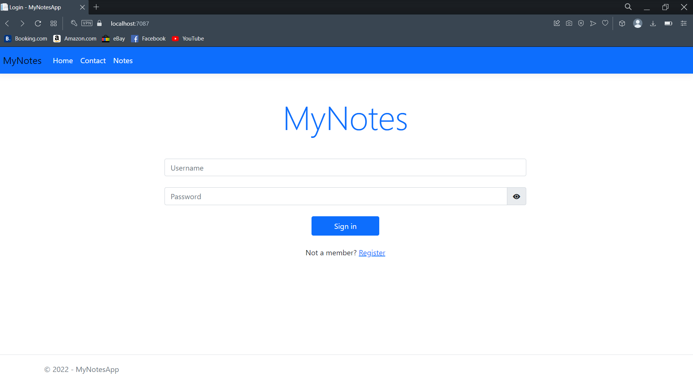
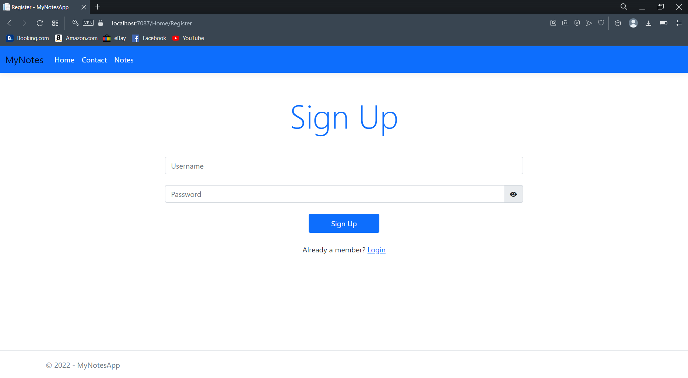
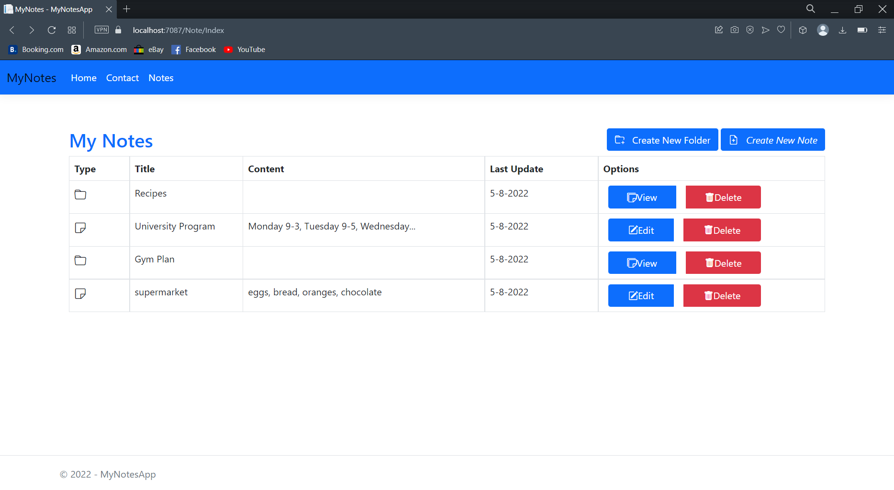
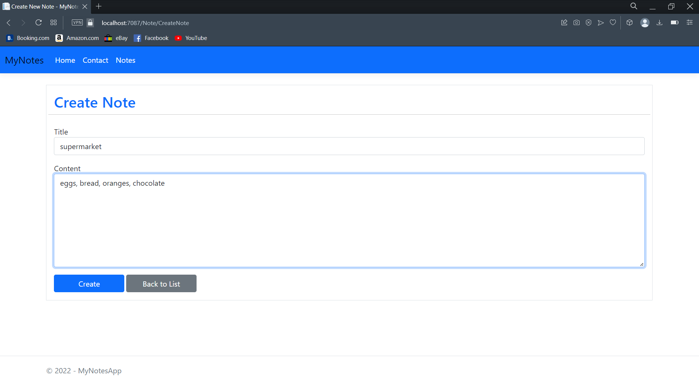
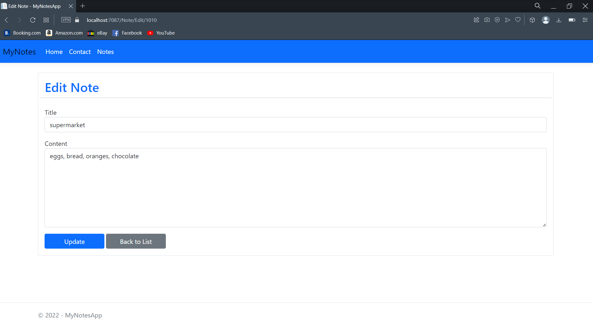
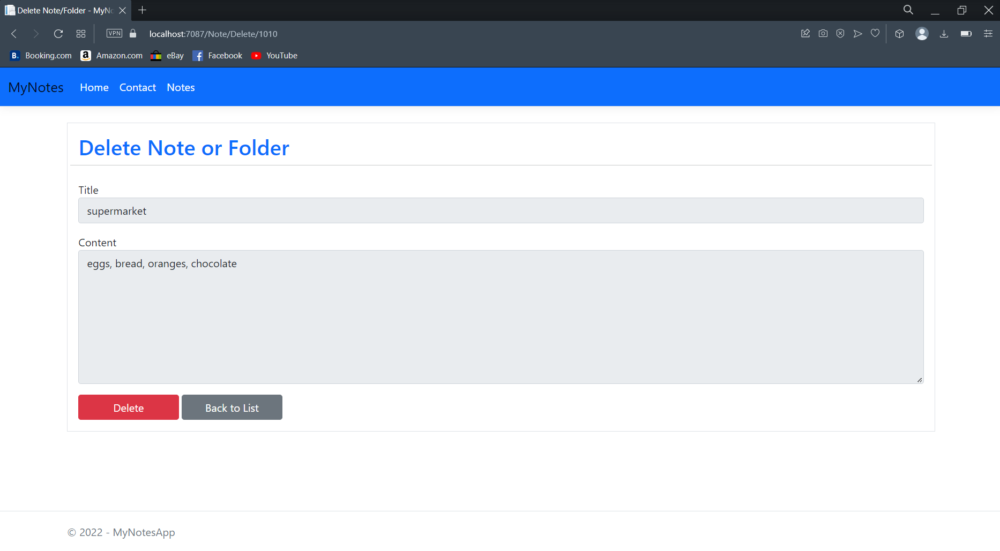
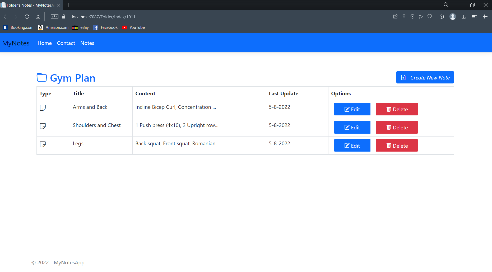

# MyNotes
MyNotes is a web application created using the C# framework ASP.NET Core. MyNotes uses Model View Controller design pattern. With this application a user can create, edit, delete notes and store them to a SQL Server database. Also a user can create a folder and store notes in it. To use the application a user firstly needs to create an account and then login to it. MyNotes app is responsive for various of screens (PCs and smartphones) 

## Login

## Register

## Notes Main Screen

## Create a Note

## Edit a Note

## Delete a Note

## View a Folder

## Technologies used in this project
- C# ASP.NET Core framework
- Microsoft SQL Server
- Javascript
- HTML
- CSS